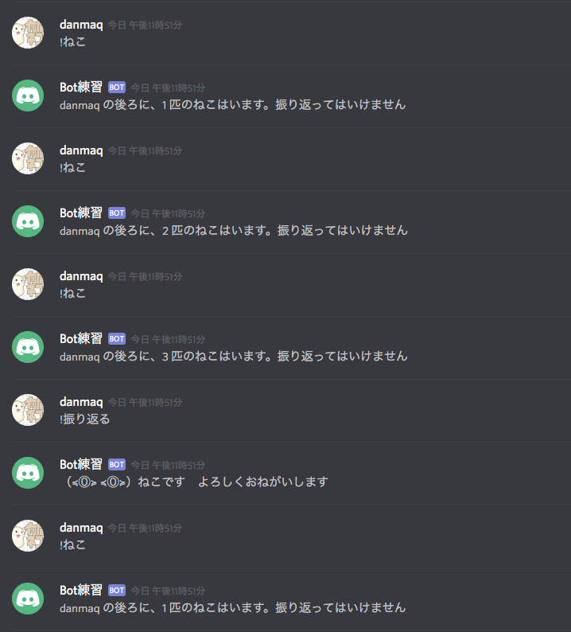

# 👻 Practice of discord bot.

## Requires

* NodeJS >= v9.5
* Token for BOT of Discord


## 🇯🇵 NIHONGO KAISETSU

### どうなるの？



#### `!ねこ`

背後にねこが増えます。振り返ってはいけません。

#### `!振り返る`

ねこが消えます。やってはいけません。 [**絶対やってはいけません。**](http://ja.scp-wiki.net/scp-040-jp)

### 予め必要なもの

* NodeJS v9.5 以降をインストールしてください
* Discord BOT 用のトークン
    * 参加させたいチャットに参加刺せとくこと

### 使い方

1. このリポジトリをクローン、もしくはダウンロード＆解凍します。
2. このフォルダ内で .env というファイルを作り、下記のような中身にします。

```
DISCORD_TOKEN=ここにDiscord BOT用のトークンをコピペする
```

3. このフォルダ内で、下記のコマンドを実行します。

Linux / Mac

```SH
$ yarn install
$ yarn start
```

Windows

```powershell
> yarn install
> yarn start
```

4. BOT を参加させているチャットで楽しんでください。ねこはいます